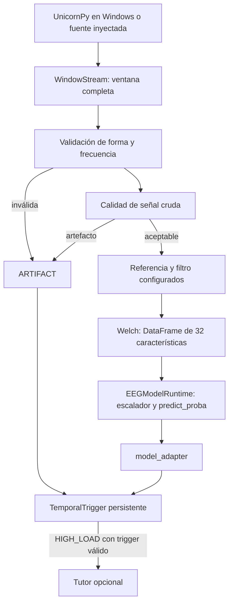

# Source Code

> Adquisición diferida, preprocesamiento, extracción, runtime, adaptador, triggering y tutor tienen interfaces y pruebas. La integración física en Windows y la equivalencia con el entrenamiento siguen pendientes. El prototipo no diagnostica condiciones médicas ni psicológicas.

Esta carpeta contiene el código reutilizable y estable del proyecto.

El objetivo es mover aquí las funciones que ya hayan sido probadas en los notebooks y que formen parte del pipeline real.

## Flujo implementado



## eeg_config.py

Centraliza `EEGConfig`, `QualityConfig` y `FEATURE_NAMES` para que adquisición,
validación y extracción compartan el mismo contrato. `from_env()` lee el entorno;
la aplicación llama `load_dotenv()` explícitamente. No lee `.env` al importar.

| Variables | Default provisional / significado |
| --- | --- |
| `EEG_SAMPLE_RATE`, `EEG_WINDOW_SECONDS` | 250 Hz, 1 s = 250 muestras exactas |
| `EEG_HOP_SECONDS`, `EEG_CHANNEL_COUNT` | 1 s sin solapamiento entre ventanas, 8 canales obligatorios |
| `EEG_THETA_HZ`, `EEG_ALPHA_HZ` | `4,8`, `8,12` |
| `EEG_BETA_HZ`, `EEG_GAMMA_HZ` | `12,30`, `30,45` |
| `EEG_FILTER_ENABLED` | `true`; permite desactivar explícitamente el filtro |
| `EEG_FILTER_LOW_HZ`, `EEG_FILTER_HIGH_HZ`, `EEG_FILTER_ORDER` | 1, 40, 4 |
| `EEG_WELCH_NPERSEG`, `EEG_WELCH_OVERLAP` | 256 (limitado al largo de ventana), 0.5 de solapamiento interno |
| `EEG_REFERENCE` | `as_acquired` conserva referencia; `common_average` resta el promedio de los 8 canales por muestra |
| `EEG_INPUT_UNITS` | `unconfirmed`; también admite `uV` o `V`. Es una declaración de unidades, no convierte valores ni verifica el SDK |
| `EEG_FLATLINE_PTP` | 0: un canal constante invalida toda la ventana |
| `EEG_MAX_ABS`, `EEG_MAX_STEP` | Vacíos: desactivados. Límites positivos de amplitud absoluta y diferencia entre muestras, en las unidades de entrada |
| `UNICORN_PYTHON_PATH` | Vacío si el SDK ya es accesible; de otro modo carpeta local `Lib` con UnicornPy y sus DLL |
| `UNICORN_SERIAL` | Vacío permite conectar solo si hay exactamente un dispositivo disponible |
| `UNICORN_FRAME_LENGTH` | `25`; muestras por bloque SDK, con buffer persistente |

Las duraciones multiplicadas por la frecuencia deben ser enteros positivos, el
paso no puede exceder la ventana y las bandas/filtro deben estar bajo Nyquist.
No se remuestrea ni se completa una ventana con ceros. Cambiar `EEG_HOP_SECONDS`
cambia el tiempo que representa la persistencia del trigger: calibrarlos juntos.
No hay un umbral de amplitud universal; se dejan esos límites vacíos hasta conocer
las unidades y calibrar el dispositivo. Esto **no certifica señal libre de ruido**.

## preprocessing.py

Funciones puras sin efectos externos:

- `validate_window(window, sample_rate=..., config=...)`: copia float64 con forma
  exacta `(window_samples, 8)`; rechaza entrada vacía, NaN/inf, strings, complejos,
  booleanos, frecuencia distinta o ventana incompleta mediante `ValueError`.
- `assess_quality(..., quality=...)`: calidad sobre señal **sin filtrar**. Devuelve
  `SignalQuality(has_artifact, reasons)`. Marca cualquier canal plano, amplitud o
  salto sobre los límites habilitados, y desbordamiento numérico. No identifica
  emociones ni distingue todos los tipos de EEG/EMG o fallos de contacto.
- `filter_window(...)`: referencia seleccionada y Butterworth SOS adelante/atrás,
  `axis=0`, padding odd explícito según la fórmula de
  [SciPy sosfiltfilt](https://docs.scipy.org/doc/scipy/reference/generated/scipy.signal.sosfiltfilt.html).
  Usa toda la ventana; no es un filtro causal con estado entre bloques. Rechaza
  ventanas demasiado cortas. No altera la matriz original.

## features.py

`extract_band_powers(window, sample_rate=..., config=...)` recibe una ventana ya
preprocesada. Produce un DataFrame `(1,32)` de potencias **sin escalar**: canal como
bucle exterior, banda Theta/Alpha/Beta/Gamma como interior. El orden es idéntico a
`FEATURE_NAMES` y se compara con el runtime antes de procesar la primera ventana.

La receta provisional es suma de bins PSD con límites inclusivos, como en las
celdas 0/1 del notebook; los bins fronterizos se comparten entre bandas.
No es una integral, potencia relativa, ratio ni cambio porcentual respecto a REST.
Welch fija explícitamente Hann periódica, detrend constante, PSD unilateral,
`scaling='density'`, promedio mean y FFT del tamaño del segmento. Así se evita
depender del nombre de la ventana por defecto de distintas versiones de SciPy.
La [documentación de Welch](https://docs.scipy.org/doc/scipy/reference/generated/scipy.signal.welch.html)
describe estos parámetros. Una banda sin bins o resultado no finito produce error.

## unicorn_stream.py

Primero ejecutar `python scripts/unicorn_smoke_test.py` en Windows desde la raíz.
Este diagnóstico no importa la arquitectura del pipeline ni requiere modelos.
Usar Python de 64 bits compatible con UnicornPy, Unicorn Suite y licencia activas.

`UnicornSource` ofrece `discover()`, `connect()`, `read_samples(count)` y `close()`.
`from_env()` solo construye la configuración; UnicornPy se importa al descubrir o
conectar, exclusivamente en Windows. Sin SDK/dispositivo, con selección ambigua o
con errores de lectura se lanza `AcquisitionError` descriptivo. No cambia la
configuración del amplificador ni activa su señal de prueba.

`frame_length` vale 25 por defecto. El buffer se reserva antes de iniciar y mantiene
`frame_length * canales_adquiridos * 4` bytes. `read_samples(count)` conserva
sobrantes entre llamadas sin cambiar el tamaño de lectura SDK.
`channel_diagnostics` expone pares (nombre, índice) antes de iniciar adquisición.

Se consultan los índices de los canales por nombre antes de iniciar adquisición,
usando `GetChannelIndex`, y se leen todos los campos del scan float32 antes de
seleccionar EEG. No se asume que los primeros ocho campos del buffer sean EEG.
El API expone esa consulta y desconecta al liberar la instancia, según su
[referencia oficial](https://github.com/unicorn-bi/Unicorn-Hybrid-Black-Windows-APIs/blob/main/python-api/unicorn-python-api-reference.md).
Se conserva el handle de búsqueda de DLL durante la sesión y se libera al cerrar.
`close()` intenta `StopAcquisition` y libera las referencias incluso si falla;
los errores de cierre normal son visibles, sin ocultar una excepción previa.

`SampleSource` es el protocolo inyectable. Sus lecturas devuelven
`SampleBlock(samples, sample_rate, has_artifact=False)`, con entre 1 y `count` filas
contiguas o una excepción; `close()` debe ser idempotente. `ArraySource` es finita,
usa solo arrays en memoria y lanza `EOFError` al agotarse. No genera modelos.

`with WindowStream(source, config=config, chunk_samples=25) as stream:` conecta y
asegura cierre por salida, excepción o Ctrl+C. Cada `next_window()` acumula una
ventana completa y conserva el solapamiento y las marcas de artefacto. No hay
hilos, loops infinitos de fondo, archivos de datos ni reconexión automática.
Una ventana final incompleta se descarta con `EOFError`; nunca se rellena.
La frecuencia entregada por la fuente debe coincidir con la configuración.

Limitaciones pendientes: el wrapper actual no interpreta Counter ni Validation
Indicator ni verifica unidades físicas; esos campos auxiliares no entran al
modelo. Hay que validar pérdidas/repeticiones de muestras y semántica de esos
indicadores con el SDK instalado antes de usarlo para intervenciones reales.
Una fuente con control adicional puede marcar `has_artifact=True`; esa marca
invalida cada ventana afectada. `GetData` puede bloquear según el SDK; no se
promete timeout ni cancelación instantánea de una llamada nativa.
El tamaño del buffer se pasa en **bytes**, siguiendo `origin/master:datos.py`;
la descripción pública del tercer argumento dice floats. Verificar este punto
contra el ejemplo incluido en la versión instalada del SDK en Windows.

## pipeline.py

`EEGPipeline(runtime, config=..., quality=..., trigger=..., tutor=None)` conserva
instancias de modelo y trigger durante la sesión. Su única operación es
`process_window(window, sample_rate=..., signal_has_artifact=False)`.

Devuelve `PipelineResult` con `features`, `model_probabilities`,
`wavesense_probabilities`, `quality`, `decision` y `tutor_text` opcional.
Si la ventana es inválida o tiene artefactos, características y probabilidades
originales son `None`, Wavesense es ARTIFACT=1 y el trigger evalúa esa marca para
romper la racha. El modelo y el tutor no se invocan. Un error posterior de
filtrado/extracción/modelo rompe la racha y se propaga; no se inventa inferencia.
El pipeline solo llama `Tutor.respond` para un `TriggerDecision` válido de
HIGH_LOAD activado. No configura alertas visuales ni abre navegador/video.
Para el uso sin UI, inyectar `Tutor` sin `visual_alert`.

El procesamiento es síncrono: una llamada de tutor puede tardar y bloquear nuevas
lecturas. Mantener tutor deshabilitado durante las primeras pruebas de hardware;
una aplicación continua deberá separar lectura y tutor, gestionar backpressure,
ventanas obsoletas y pérdidas, y crear una nueva sesión de trigger al reconectar.

### Windows: preparación y una ventana real

1. Instalar Unicorn Suite/UnicornPy mediante el fabricante, activar la licencia
   correspondiente y emparejar el dispositivo. Usar Python >=3.10 compatible con
   la versión/arquitectura del SDK y las dependencias del modelo. Confirmar estas
   compatibilidades en el equipo; no se añade UnicornPy a `requirements.txt`.
   Consultar la [guía oficial de instalación](https://github.com/unicorn-bi/Unicorn-Hybrid-Black-Windows-APIs/blob/main/python-api/unicorn-python-api.md).
2. Desde la raíz, PowerShell:

```powershell
python -m venv .venv
.\.venv\Scripts\Activate.ps1
python -m pip install -r requirements.txt
# Solo si aún no tienes .env; conservar cualquier configuración local existente
Copy-Item .env.example .env
python -m unittest discover -s tests -v
```

3. Editar `.env`: apuntar `EEG_MODEL_PATH` y `EEG_SCALER_PATH` a los artefactos
   locales de confianza (`./models/...` o las rutas reales). Configurar
   `UNICORN_PYTHON_PATH` únicamente si hace falta: usar una ruta local entre
   comillas, preferiblemente con `/`, nunca una ruta personal en código.
   Confirmar nombres/orden físicos, bandas, referencia, unidades y límites de
   calidad antes de conectar. `OPENAI_API_KEY` puede permanecer vacía.
4. Tras esas verificaciones, ejecutar este código desde una aplicación local:

```python
from dotenv import load_dotenv
from src.eeg_config import EEGConfig, QualityConfig
from src.models import EEGModelRuntime
from src.pipeline import EEGPipeline
from src.triggering import TemporalTrigger
from src.unicorn_stream import UnicornSource, WindowStream

load_dotenv()
config = EEGConfig.from_env()
pipeline = EEGPipeline(
    EEGModelRuntime.from_env(), config=config, quality=QualityConfig.from_env(),
    trigger=TemporalTrigger(), tutor=None,
)
with WindowStream(UnicornSource.from_env(), config=config) as stream:
    block = stream.next_window()  # Una ventana; conexión cerrada al salir.
    result = pipeline.process_window(
        block.samples, sample_rate=block.sample_rate,
        signal_has_artifact=block.has_artifact,
    )
    print(result.quality, result.wavesense_probabilities, result.decision)
```

### Simulación sin SDK, modelos reales, OpenAI ni navegador

Las pruebas de integración contienen fuente sintética y dobles en memoria; no se
escriben `.pkl` sustitutos ni datasets. Ejecutar desde la raíz en Windows o Linux:

```bash
python -m unittest discover -s tests -p 'test_eeg_pipeline.py' -v
python -m unittest discover -s tests -p 'test_unicorn_stream.py' -v
```

Para probar solo adquisición/extracción en memoria:

```python
import numpy as np
from src.eeg_config import EEGConfig
from src.features import extract_band_powers
from src.preprocessing import filter_window
from src.unicorn_stream import ArraySource, WindowStream

config = EEGConfig()
time = np.arange(config.window_samples) / config.sample_rate
samples = np.sin(2 * np.pi * 10 * time[:, None]) * np.arange(1, 9)
with WindowStream(ArraySource(samples, sample_rate=250), config=config) as stream:
    block = stream.next_window()
    filtered = filter_window(block.samples, sample_rate=block.sample_rate, config=config)
    print(extract_band_powers(filtered, sample_rate=block.sample_rate, config=config))
```

Estos senos son estímulos de prueba de software, no grabaciones EEG ni una
validación de las probabilidades de un clasificador.

## models.py

`EEGModelRuntime` carga una vez el modelo local y el escalador opcional mediante
`EEGModelRuntime.from_env()`. Usa `joblib.load`, compatible con los artefactos
locales inspeccionados. `EEG_MODEL_PATH` es obligatoria; `EEG_SCALER_PATH` vacía
omite el escalador. Si se configura una ruta inexistente o ilegible, falla sin
continuar silenciosamente. Las rutas relativas parten del directorio de trabajo;
se admite `~`. La aplicación carga `.env` si lo necesita. Importar el módulo no
carga artefactos ni inicia servicios. Cargar solo archivos pickle/joblib locales
de confianza: su deserialización puede ejecutar código.

### Contrato de entrada y salida

- `predict_proba(features, *, feature_names=None)` recibe un vector `(p,)` o una
  matriz `(1, p)` de números reales, finitos, no vacía. Devuelve
  `dict[str, float]`, con las etiquetas originales y el orden de `model.classes_`.
- `predict_proba_batch(features, *, feature_names=None)` acepta `(n, p)` y devuelve
  una lista de esos diccionarios, uno por fila y en el mismo orden. También admite
  un vector como lote de una fila. El método individual rechaza varias filas para
  evitar descartar ventanas o promediar probabilidades implícitamente.
- Se acepta `pandas.DataFrame` con columnas exactas o arrays/listas acompañados de
  `feature_names`, que declara el orden real de sus valores. No se reordenan
  columnas automáticamente. No se aceptan strings numéricos, booleanos, complejos,
  NaN/inf, variables adicionales ni nombres duplicados.
- `runtime.feature_names` es la tupla ordenada del contrato y `runtime.n_features`
  es su dimensión. Se obtienen de `feature_names_in_` del modelo/escalador. Si
  ambos lo tienen, deben coincidir. También se valida `n_features_in_`.
  Si faltan nombres en ambos artefactos, se exige
  `from_env(feature_names=esquema_confirmado_por_entrenamiento)` (o el mismo
  argumento al constructor). La dimensión sola no identifica características.
  El error `ModelContractError` explica qué falta; no se inventa un esquema.
- El escalador ejecuta `transform` antes de `model.predict_proba`; nunca `fit`.
  Debe conservar filas, variables y orden. Se entregan DataFrames a estimadores
  que guardan nombres. Las probabilidades deben tener una columna por clase,
  ser finitas, estar en `[0, 1]` y sumar aproximadamente uno por fila.
  No se aplica softmax, normalización ni redondeo en el runtime.
- Cada diccionario se pasa directamente a
  `to_wavesense_probabilities(output, signal_has_artifact=...)`. La calidad de
  señal se determina fuera del runtime. El adaptador conserva la responsabilidad
  de convertir clases a REST / LOW_LOAD / HIGH_LOAD / ARTIFACT.
  Las etiquetas de nuevos modelos deben ser compatibles con el mapeo documentado
  en `ADAPTACION_WAVESENSE.md`; el runtime no renombra clases.

### Características observadas y trabajo pendiente de adquisición

Los archivos locales ignorados `modelo_eeg_unicorn.pkl` (RandomForestClassifier)
y `escalador_eeg.pkl` (StandardScaler) declaran 32 características idénticas:

```python
# Orden exacto observado en feature_names_in_ de ambos artefactos:
observed_names = tuple(
    f"Canal_{channel}_{band}"
    for channel in range(1, 9)
    for band in ("Theta", "Alpha", "Beta", "Gamma")
)
```

Primero las cuatro bandas de Canal_1, luego Canal_2, hasta Canal_8. Las clases
observadas, en orden, son `BRAWL_STARS`, `DIBUJANDO`, `MATH_LOAD`, `REST`,
`SUBWAY_SURFERS`. Estos datos describen los artefactos inspeccionados, no se
codifican como valores obligatorios en el runtime genérico; este extractor sí
requiere las 32 columnas exactas y rechaza otro esquema.

El notebook `analisis_eeg.ipynb`, idéntico en la referencia local `origin/modelo`,
muestra una extracción candidata: 250 Hz; Butterworth de orden 4 entre 1 y
40 Hz con `filtfilt`; ventanas de hasta 250 muestras; `welch` por canal y suma
de bins PSD con límites inclusivos Theta 4–8, Alpha 8–12, Beta 12–30 y Gamma
30–45 Hz. Selecciona canales desde las columnas CSV y contiene otros análisis
con ventanas de 10 segundos. Su StandardScaler se presenta como normalización
para visualización; no contiene el entrenamiento/exportación que vincule
inequívocamente esa receta con ambos `.pkl`.

La referencia `origin/master:datos.py` revisada usa 10 segundos, paso de 1 segundo,
Welch de hasta 512 muestras, integra PSD con trapecios y restringe Gamma a 30–40 Hz.
No se importó ni fusionó esa rama: su índice experimental no sustituye al vector
que requiere el modelo. El default de paso de 1 segundo es una decisión provisional
del runtime; el notebook usa un paso variable según la duración de cada CSV.
El filtrado por ventana con SOS también difiere del filtrado de toda la grabación
con `filtfilt` del notebook, particularmente en los bordes.

Por tanto, **se conoce el esquema de 32 columnas, pero falta confirmar la receta
de entrenamiento**: correspondencia física y unidades de Canal_1…Canal_8,
ventana y paso usados, parámetros/versiones exactos de Welch y filtros, estado
entre ventanas y si el clasificador fue entrenado con ese escalador. No se debe
sustituir la suma de bins por integrales, ratios o porcentajes de línea base sin
confirmarlo. La presencia de Gamma hasta 45 Hz junto al filtro hasta 40 Hz también
debe reconciliarse con el entrenamiento. Los nombres no permiten resolverlo.

El extractor implementado entrega una fila por ventana con esas 32 potencias
**antes del escalado externo**, usando la receta provisional configurable. El
equipo debe confirmar la receta para habilitar el uso real. Debe adjuntar los nombres reales de extracción o construir
un DataFrame en ese orden; copiar `runtime.feature_names` como etiqueta de valores
desconocidos no valida su significado. El indicador de artefacto viajará separado
al adaptador. `models.py` no adquiere Unicorn, filtra, extrae características,
decide triggers ni llama al tutor/OpenAI.

### Uso local

Desde la raíz, con las dependencias de `requirements.txt` instaladas y los
artefactos de confianza ya presentes (no se versionan):

```bash
export EEG_MODEL_PATH=./modelo_eeg_unicorn.pkl
export EEG_SCALER_PATH=./escalador_eeg.pkl
python -c 'from src.models import EEGModelRuntime; r = EEGModelRuntime.from_env(); print(r.feature_names); print(r.classes)'
```

Inferencia sobre un CSV **local** de características ya calculadas, con encabezados
exactos y sin columna de etiqueta, índice ni timestamp:

```bash
python - <<'PYCODE'
import pandas as pd
from src.models import EEGModelRuntime
from src.model_adapter import to_wavesense_probabilities

runtime = EEGModelRuntime.from_env()
features = pd.read_csv("data/processed/ventana_features.csv")  # Una fila real.
output = runtime.predict_proba(features)
print(output)
print(to_wavesense_probabilities(output, signal_has_artifact=False))
PYCODE
```

Para un array proporcionado por el extractor:
`output = runtime.predict_proba(vector, feature_names=nombres_del_extractor)`.
Para varias ventanas, usar `predict_proba_batch` y aplicar el adaptador a cada
salida con el indicador de calidad correspondiente. Reutilizar la instancia;
no cargar los archivos en cada ventana. El CSV del ejemplo debe producirlo una aplicación externa a partir del
extractor confirmado: no se proporciona un vector inventado ni se ejecuta el notebook.

## triggering.py

Implementa la lógica que decide cuándo una predicción debe producir una intervención.

Reglas implementadas:

- threshold de probabilidad;
- persistencia durante varias ventanas;
- bloqueo por artefactos;
- cooldown entre triggers.

## tutor.py

`Tutor.respond(decision)` recibe un `TriggerDecision` de `src.triggering`. Devuelve `None` sin llamar a OpenAI ni ejecutar herramientas cuando `triggered=False` o el estado no es `HIGH_LOAD`; `ARTIFACT` nunca es intervenible. Si la decisión es válida, devuelve texto generado con estado y confianza como único contexto del modelo local.

La política inicial definida en Python es ofrecer ayuda breve para trabajar en pasos pequeños. OpenAI solo redacta el texto: no selecciona acciones ni ejecuta herramientas. No hay escalado automático. El equipo debe definir los niveles de ayuda, cuándo avanzar o reiniciarlos y cómo incorporar contexto de la tarea antes de añadir una progresión pedagógica.

Ejemplo de conexión para que la aplicación lo invoque con cada salida del modelo local:

```python
from dotenv import load_dotenv

from src.model_adapter import to_wavesense_probabilities
from src.triggering import TemporalTrigger
from src.tutor import Tutor

load_dotenv()  # Opcional: cargar el .env local de la aplicación.
trigger = TemporalTrigger()  # Conservar la instancia durante la sesión.
tutor = Tutor(model="<modelo habilitado por el equipo>")

def process_prediction(model_output, signal_has_artifact=False):
    probabilities = to_wavesense_probabilities(model_output, signal_has_artifact)
    decision = trigger.evaluate(probabilities)
    return tutor.respond(decision)
```

Entregar cada decisión una sola vez al tutor. No construir decisiones manualmente ni recrear `TemporalTrigger` por ventana, pues perdería persistencia y cooldown. La API key se lee exclusivamente de `OPENAI_API_KEY`, solo al necesitar una intervención. Si falta o está vacía, se lanza `RuntimeError` con un mensaje de configuración sin secretos. Los errores de API se propagan a la aplicación sin reintentos automáticos ni alertas; el cooldown ya aplicado por triggering se conserva. Un cliente inyectado mediante `client=` permite pruebas sin credenciales y su ciclo de vida corresponde al llamador.

Se utiliza `responses.create` del [SDK oficial de OpenAI](https://developers.openai.com/api/reference/python), sin herramientas del LLM. Importar o ejecutar `tutor.py` no inicia simulaciones, clientes ni ventanas.

## tools/visual_alert.py

`show_visual_alert(text)` muestra texto en un diálogo local y requiere Tk y una sesión gráfica. Está aislada y desactivada por defecto. La aplicación puede habilitarla explícitamente con `Tutor(model=..., visual_alert=show_visual_alert)`; se ejecuta únicamente después de obtener ayuda para un trigger válido. No abre el navegador. Las pruebas sustituyen la interfaz gráfica por mocks.

## tools/distraction_video.py

`open_distraction_video()` abre el video configurado en `DISTRACTION_VIDEO_URL`
en el navegador predeterminado. El equipo debe configurar este enlace no secreto
en el entorno o en su `.env` local, cargado por la aplicación. Si falta o está
vacío, lanza `RuntimeError` sin abrir nada. Devuelve el resultado de
`webbrowser.open` (un booleano que indica si se pudo iniciar el navegador).
Importar la herramienta no abre el navegador.

El tutor no invoca esta herramienta y OpenAI no la recibe ni decide ejecutarla.
La aplicación puede llamarla explícitamente solo después de recibir texto:

```python
from src.tools.distraction_video import open_distraction_video

# decision proviene de la instancia persistente de TemporalTrigger.
text = tutor.respond(decision)
if text:
    # Llamada opcional, habilitada por la aplicación según su política.
    open_distraction_video()
```

No pasar esta función como `visual_alert` del tutor ni registrarla como herramienta
del LLM. La alerta de video es una acción separada y explícita de la aplicación.
Las pruebas simulan el navegador y no abren TikTok.

## Important

No agregar código experimental desorganizado aquí.

Los experimentos iniciales deben realizarse primero en `notebooks/`.

No guardar aquí datos, modelos entrenados, credenciales ni resultados de experimentos.
